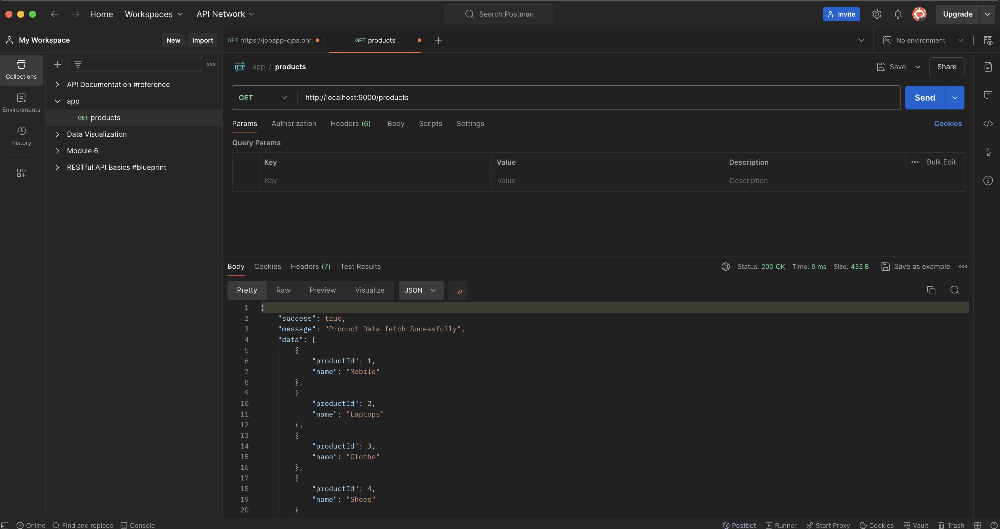
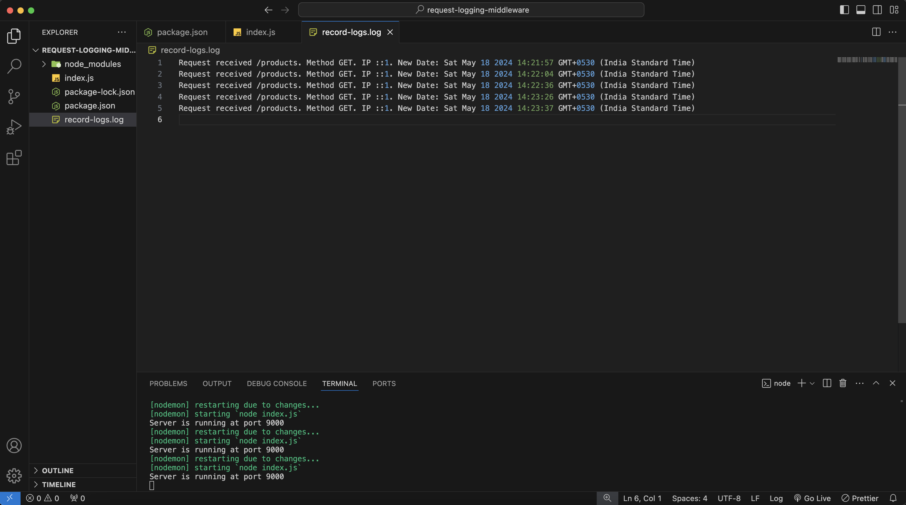

# Request Logging Middleware

## Overview

This is a simple Express.js API that provides product data and logs requests to a file. It includes middleware for request logging and handles errors for undefined paths.

## ScreenShort

- `Postman`



- `Logging Records`



## Features

- Fetch product data
- Log each request with details such as URL, method, IP address, and timestamp
- Handle undefined paths with appropriate error messages

## Setup and Installation

1. **Install dependencies**:
    ```sh
    npm install
    ```

2. **Run the server**:
    ```sh
    node app.js
    ```

## Endpoints

### Get Products

- **URL**: `/products`
- **Method**: `GET`
- **Description**: Fetches the list of products.

- **Response**:
    ```json
    {
        "success": true,
        "message": "Product Data fetch Successfully",
        "data": [
            {
                "productId": 1,
                "name": "Mobile"
            },
            {
                "productId": 2,
                "name": "Laptops"
            },
            {
                "productId": 3,
                "name": "Cloths"
            },
            {
                "productId": 4,
                "name": "Shoes"
            }
        ]
    }
    ```

### Handle Undefined Paths

- **URL**: `/*`
- **Method**: Any
- **Description**: Handles any undefined paths with an error message.

- **Response**:
    ```json
    {
        "success": false,
        "error": "Path not Found"
    }
    ```

## Middleware

### Request Logging Middleware

The middleware logs each request with the following details:
- URL
- Method
- IP address
- Timestamp

**Code**:
```javascript
function checkMiddlewear(req, res, next) {
    fs.appendFileSync("record-logs.log", `Request received ${req.url}. Method ${req.method}. IP ${req.ip}. New Date: ${new Date()} \n`);
    next();
}
```

This middleware is used in the `/products` route to log every request made to this endpoint.

### Logs
All request logs are stored in the `record-logs.log` file in the project directory. Each log entry contains the request URL, method, IP address, and the timestamp of the request.

### Example
To fetch the product data, make a GET request to:
```bash
http://localhost:9000/products
```
The request will be logged in the record-logs.log file with the appropriate details.

### License
This project is licensed under the MIT License.
